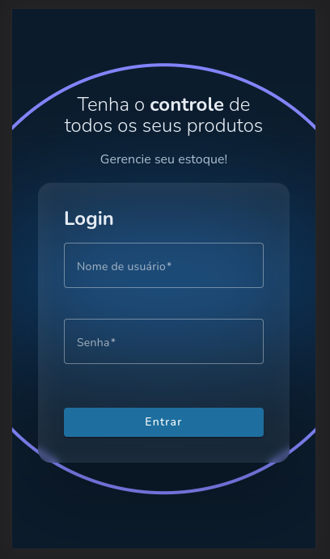
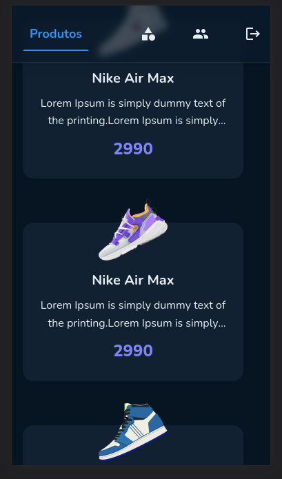
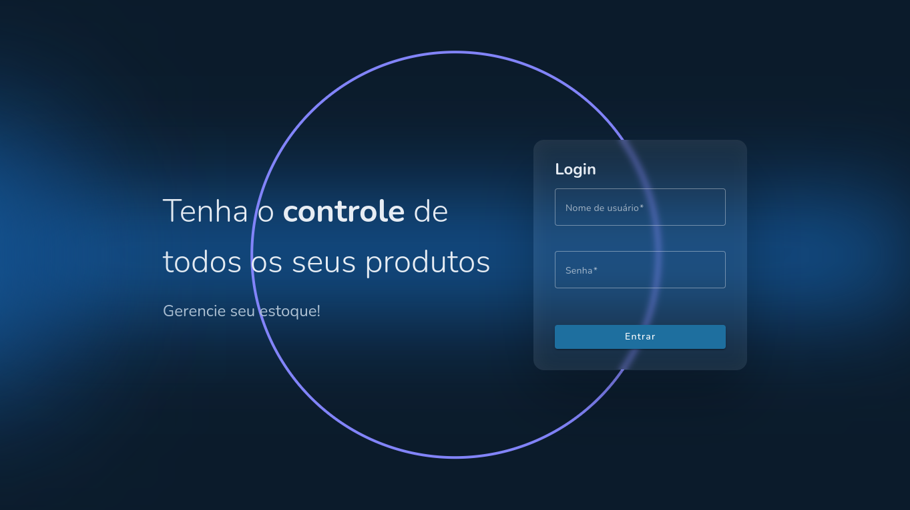
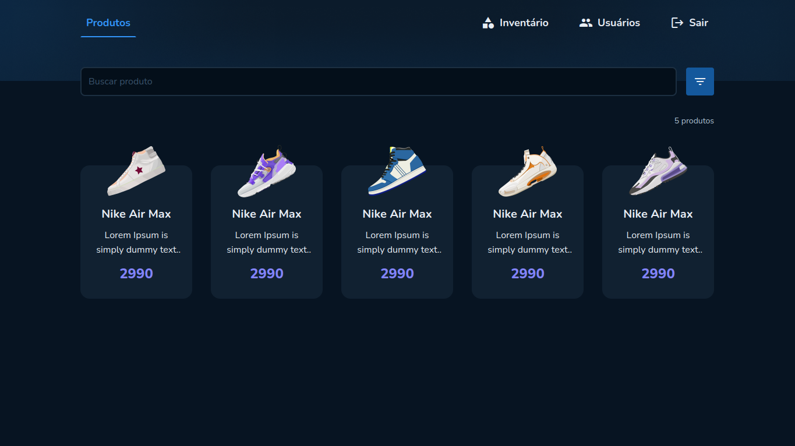
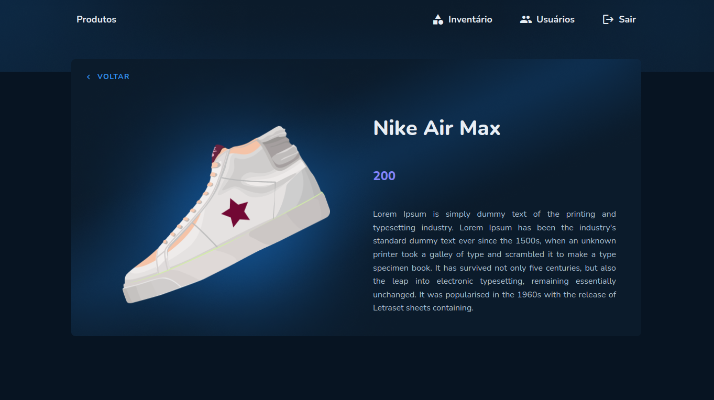
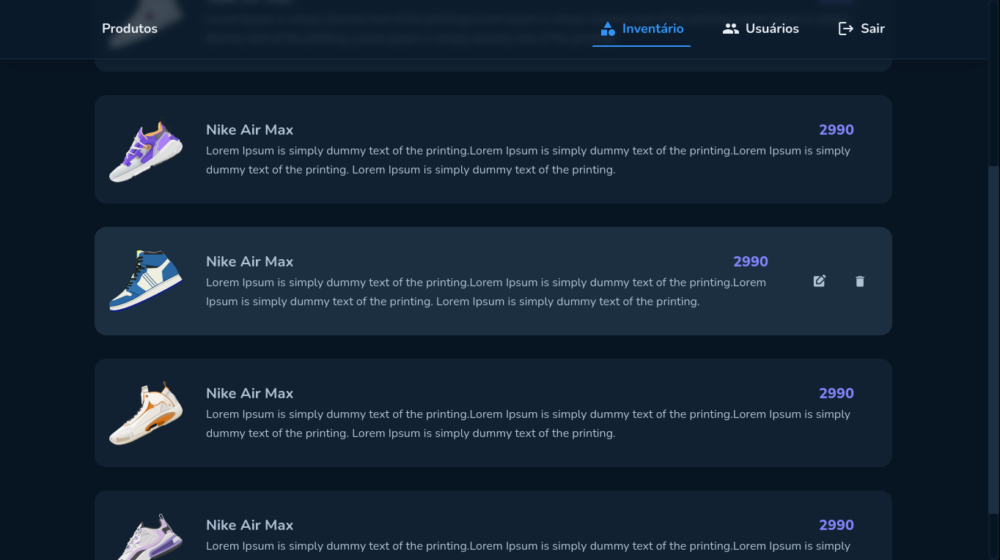
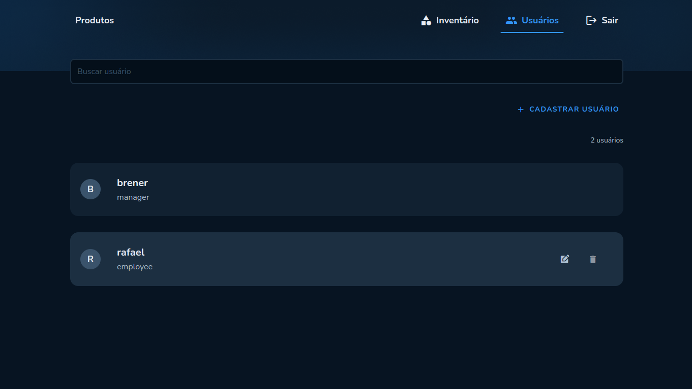

# Inovamobil

This project was generated with [Angular CLI](https://github.com/angular/angular-cli) version 15.0.2.

## Development server

Run `ng serve` for a dev server. Navigate to `http://localhost:4200/`. The application will automatically reload if you change any of the source files.

## Further help

To get more help on the Angular CLI use `ng help` or go check out the [Angular CLI Overview and Command Reference](https://angular.io/cli) page.

<br>
<br>

<div align="center" >
  
  
</div>
<br>
<div align="center" >
  
</div>
<br>

<div align="center" >
  
</div>
<br>

<div align="center" >
  
</div>
<br>

<div align="center" >
  
</div>
<br>

<div align="center" >
  
</div>
<br>

<br>

## 🛠 Tecnologias

Esse projeto foi desenvolvido com as seguintes tecnologias:
- HTML
- SCSS
- Typescript
- Angular
- Material Angular

<br>

## 📜 Projeto

É um sistema para realizar o CRUD de produtos de uma empresa, assim como uma tela de acesso ao sistema e um CRUD de usuários, permitindo o acesso de apenas usuários cadastrados, sendo necessário o logout imediato em casos de token expirado. Foi desenvolvido com a finalidade para teste e estudos.

<br>

### 📚 Pré-requisitos

Antes de começar, você vai precisar ter instalado em sua máquina as seguintes ferramentas:
[Git](https://git-scm.com), [Node.js](https://nodejs.org/en/).
Além disto é bom ter um editor para trabalhar com o código como [VSCode](https://code.visualstudio.com/)

<br>

### ⚙️ Rodando o Web

```bash
# Clone este repositório
$ git clone https://github.com/Brenerr/inovamobil.git

# Acesse a pasta do projeto no terminal/cmd
$ cd inovamobil

# Instale as dependências
$ npm install

# Execute a aplicação em modo de desenvolvimento
$ ng server 

# Abra no seu navegador: `http://localhost:4200/`.
